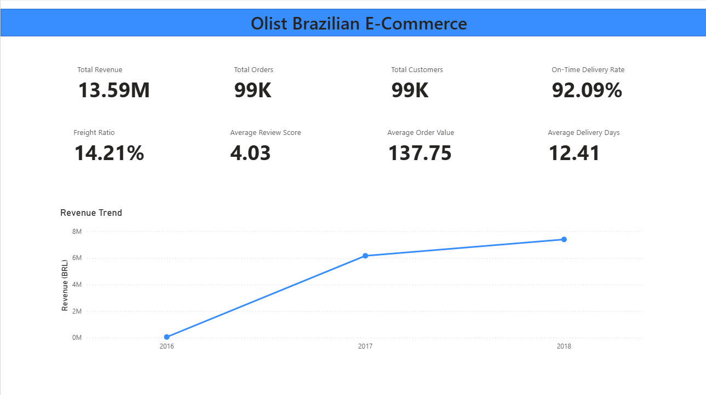
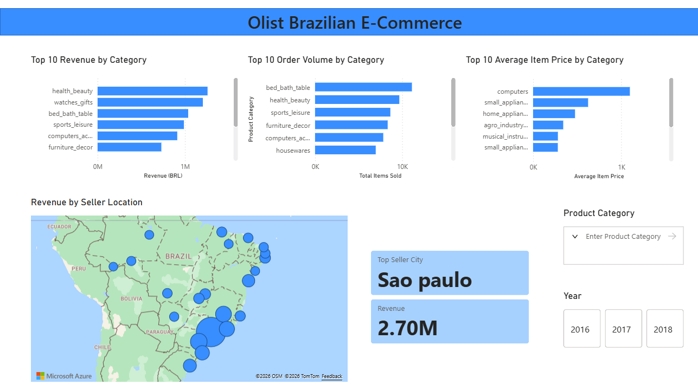
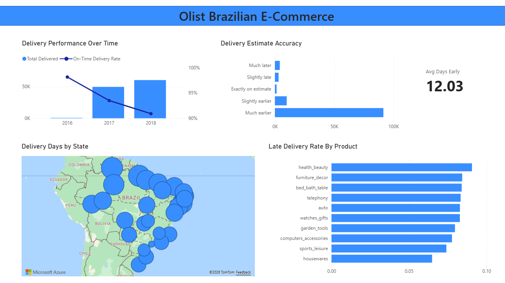
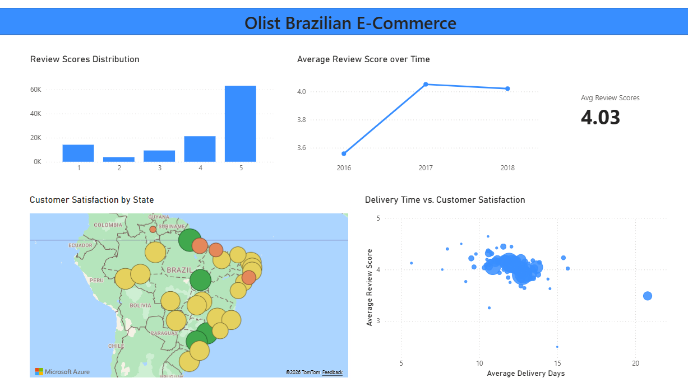
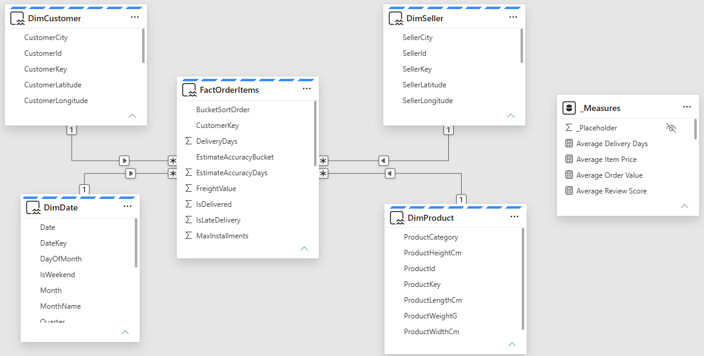
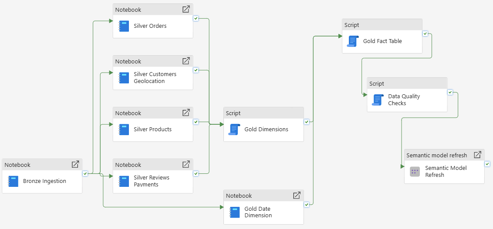

# Olist E-Commerce Analytics — End-to-End Microsoft Fabric Platform

> **🎯 Business Question:** How can revenue, customer satisfaction, and delivery performance be analyzed and optimized on the Olist e-commerce marketplace?

An end-to-end data analytics platform built on **Microsoft Fabric** — from raw CSV files to interactive Power BI dashboards — using the **Medallion architecture** (Bronze → Silver → Gold), a Direct Lake semantic model, and an orchestrated, self-monitoring pipeline.

Treated as production data: duplicate geolocations, inconsistent encodings, and ambiguous grain were investigated and resolved — not assumed away.

## 📊 Dashboards

### Executive Summary


- **What is the overall business performance at a glance?** — Total Revenue, Orders, Customers, AOV, Delivery metrics, Review Score, Freight Ratio as unified KPIs
- **How has revenue evolved over time, and are there seasonal patterns?** — Revealed a sharp Black Friday spike (Nov 24, 2017) at day-level drill-down

### Sales Analysis


- **Which product categories generate the most revenue, and how does that differ from order volume?** — Top categories by revenue vs. by units sold aren't identical (high-value vs. high-volume categories differ)
- **What is the average item price by category?** — Identifies premium vs. budget-tier categories
- **Which regions/cities generate the most seller revenue?** — São Paulo dominant, visualized via seller location map

### Logistics Performance


- **How does delivery time vary by customer state?** — Longer delivery times concentrated in northern/northeastern Brazil
- **How has delivery performance (on-time vs. late) evolved over time?** — On-time rate declined from ~98% (2016) to ~91% (2018) as volume grew — inverse relationship between scale and punctuality
- **How accurate are Olist's delivery time estimates?** — Deliveries arrive ~12 days earlier than estimated on average — systematic under-promising
- **Which product categories have the highest late-delivery rates?** — health_beauty (top revenue category) also has the highest late-delivery rate among top-10 categories

### Customer Insights


- **How are customer review scores distributed?** — J-curve pattern: 5★ dominant, but 1★ more common than 2★/3★ (polarized rating behavior)
- **How has average customer satisfaction changed over time?** — Rose sharply 2016→2017, then stayed roughly flat (~4.0–4.05) through 2018 despite declining delivery punctuality
- **Does delivery time affect customer satisfaction?** — Weak relationship in the normal range (10–14 days), but a clear drop-off for extreme outliers (20+ days)
- **How does customer satisfaction vary by state?** — Lower satisfaction concentrated in the same northern/northeastern regions with longer delivery times — geography links logistics performance to customer experience

---

## 🏗 Architecture

**Dataset:** Olist Brazilian E-Commerce Public Dataset — ~99,441 orders, 2016–2018, 9 relational CSV files.

**Tech Stack:** Microsoft Fabric · Lakehouse · Data Warehouse · PySpark · T-SQL · Power BI (Direct Lake) · DAX · Data Pipelines

```
CSV Files (Kaggle)
    |
    v

  BRONZE          SILVER           GOLD
  Lakehouse  ---> Lakehouse  --->  Warehouse
  (raw, as-is)    (cleaned,        (star schema
                   typed)           + business logic)
                                        |
                                        v
                              Semantic Model
                              (Direct Lake, DAX)
                                        |
                                        v
                              Power BI Dashboards
                              Executive / Sales /
                              Logistics / Customer

   All orchestrated end-to-end by a Fabric Data Pipeline
   with data quality gating and failure alerting.
```

**Why Lakehouse for Bronze/Silver, Warehouse for Gold?** Spark/Lakehouse gives the flexibility needed for raw and semi-structured transformation work. The Gold layer, acting as the single source of truth for reporting, benefits from a SQL engine's stricter schema guarantees and native Power BI integration.

## 🗂 Data Model (Star Schema)



One fact table (`FactOrderItems`) at **"sold item"** grain, four conformed dimensions with surrogate keys. Payment and review data are aggregated to one row per order and embedded as denormalized fields in the fact table rather than modeled as separate fact tables — see Data Engineering Challenges for why.

## 🔍 Data Engineering & Quality Challenges

Beyond the dashboards, three questions required deeper investigation rather than a chart:

- **Are Olist's payment records internally consistent with order values?** — 379 orders show payment/item mismatches; 362 explained by installment interest, 17 by multi-payment-type orders
- **Is the geolocation reference data reliable enough to support geographic analysis?** — No, not without cleanup — required a 3-stage fix (whitespace/case → accents → typo tie-breaking) before it was trustworthy
- **What share of sellers/customers can't be geographically mapped, and why?** — 134 sellers / 278 customers, traced to 7 missing zip-code prefixes in the source geolocation dataset — a documented, accepted data gap, not a pipeline bug

### The row-count mystery

`FactOrderItems` had 113,314 rows vs. an expected 112,650 (`order_items` count). Diagnosed by adding one join at a time and checking row counts after each step — isolated the reviews join as the cause. A first estimate (simple review-duplicate count) only explained 551 of the 664 extra rows; the remaining 113 came from a **multiplicative effect**: orders with both multiple items *and* multiple reviews. Fixed by aggregating reviews to one-per-order (`ROW_NUMBER() OVER (PARTITION BY order_id ORDER BY review_creation_date DESC)`) before joining — the same pattern used for payments.

### Geolocation deduplication (three root causes, layered)

- Grouping by `(prefix, city, state)` still left duplicates per zip prefix
- **Cause 1:** whitespace/case inconsistency → fixed with `trim()`/`lower()`
- **Cause 2:** accented character inconsistency ("ibiaça" vs "ibiaca") → fixed with `F.translate()` to strip diacritics
- **Cause 3** (remaining ~555 cases): genuine typos or two distinct towns sharing a zip prefix → resolved with a tie-breaker (`Window` + `row_number()`, most frequent city/state pairing wins) — a documented simplification, not a "perfect" fix
- Bonus finding: 304 city names exist in *multiple* Brazilian states (e.g. "agua boa" in 3 states) — confirming `(city, state)` must always be treated as a pair, never `city` alone

### Fact table grain decisions

Payments went through three modeling iterations before landing on the final design:

- Static PIVOT by payment type → missed a rare `not_defined` type, abandoned
- Separate `DimPaymentType` + `FactPayments` → abandoned due to **grain mismatch** — a payment applies to a whole order, but an order can span multiple sellers/products, so no clean join to `DimSeller`/`DimProduct` exists
- **Final:** aggregated to one row per order, embedded as denormalized fields in `FactOrderItems`

### Documented, accepted anomalies (not bugs)

| Finding | Count | Explanation |
|---|---|---|
| Sellers without geo-coordinates | 134 / 3,095 | 7 zip prefixes missing from source geolocation data |
| Customers with implausible coordinates | 4 | Sign-flip error traced to Bronze raw data itself |
| Orders with payment/item value mismatch | 379 | 362 explained by installment interest (correlated with `max_installments`); 17 by multi-payment-type orders |

## ⚡ DAX & Direct Lake Engineering Highlights

**Direct Lake constraint — no calculated columns.** Direct Lake models only support measures, not DAX-calculated columns. Fields needed for sorting/grouping (e.g. `DayOfMonth`, `BucketSortOrder`) had to be pushed back into the source layer (PySpark notebook or Gold SQL) instead of the semantic model.

**Filter context conflict, solved with `KEEPFILTERS()`:**

```dax
// This measure broke — identical values across all ReviewScore categories —
// because the CALCULATE filter conflicted with the chart's own axis filter
// on the same column.
Reviewed Items (broken) =
CALCULATE(
    COUNTROWS(FactOrderItems),
    NOT ISBLANK(FactOrderItems[ReviewScore])
)

// Fixed: wrapping the filter in KEEPFILTERS as a standalone top-level
// CALCULATE argument ensures it *adds to* rather than *overrides* the
// chart's existing filter context.
Reviewed Items =
CALCULATE(
    COUNTROWS(FactOrderItems),
    KEEPFILTERS(NOT ISBLANK(FactOrderItems[ReviewScore]))
)
```

See `dax/` for the full measure library (Total Revenue, Late Delivery Rate, Top Seller City, Reviewed Items, and more), organized by business domain: `sales_metrics.dax`, `logistics_metrics.dax`, `customer_metrics.dax`.

## 🔁 Pipeline Automation & Data Quality Gates



The Data Quality Checks step distinguishes a **technical execution failure** from a **content quality failure** — a SQL script can run successfully and still return bad results (e.g. orphan records > 0). A `THROW` inside the script converts critical check failures into real pipeline failures, which trigger an email alert via the on-failure path — stopping bad data before it reaches the semantic model or reports.

See `sql/DWH-DataQualityChecks.sql` for the full check suite.

## 📁 Repo Structure

```
├── docs/
│   ├── architecture/         # Semantic model + pipeline screenshots
│   │   ├── data_model.png
│   │   └── pipeline.png
│   └── dashboards/           # Dashboard screenshots
│       ├── executive_summary.png
│       ├── sales_dashboard.png
│       ├── logistics_dashboard.png
│       └── customer_dashboard.png
├── dax/                       # DAX measures, organized by business domain
│   ├── customer_metrics.dax
│   ├── logistics_metrics.dax
│   └── sales_metrics.dax
├── notebooks/                 # Fabric PySpark notebooks (Bronze/Silver)
│   ├── nb_bronze_ingestion.ipynb
│   ├── nb_silver_orders.ipynb
│   ├── nb_silver_customers_geolocation.ipynb
│   ├── nb_silver_products.ipynb
│   ├── nb_silver_reviews_payments.ipynb
│   └── nb_gold_dim_date.ipynb
├── sql/                        # Gold layer schema + data quality checks
│   ├── DWH-Dimensions.sql
│   ├── DWH-Fact.sql
│   └── DWH-DataQualityChecks.sql
└── README.md
```

## 🔑 Key Takeaways

- Real-world data quality issues rarely have a single root cause — the geolocation duplicate problem required three separate, layered fixes before it was actually resolved.
- Row-count mismatches in fact tables are best diagnosed by adding joins incrementally, not guessing at the aggregate level.
- A fact table's grain should be decided by what can be joined cleanly, not by what seems intuitive — this is why a separate `FactPayments` table was designed, tested, and ultimately rejected.
- Not every anomaly is a bug. Documenting *and quantifying* accepted data gaps is as important as fixing genuine defects.
